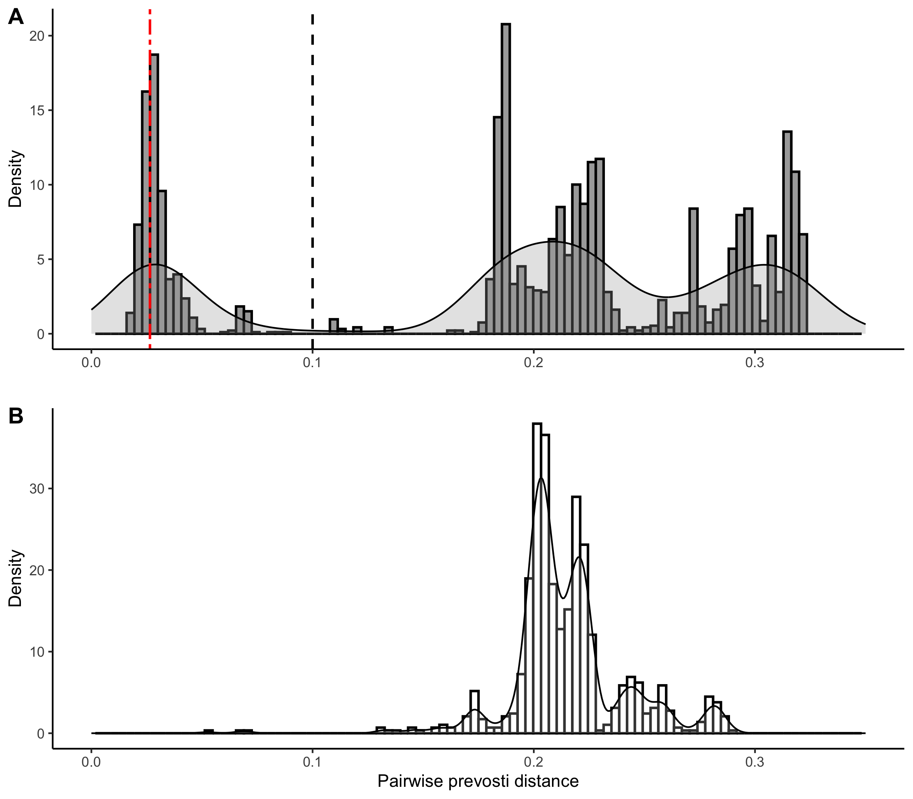
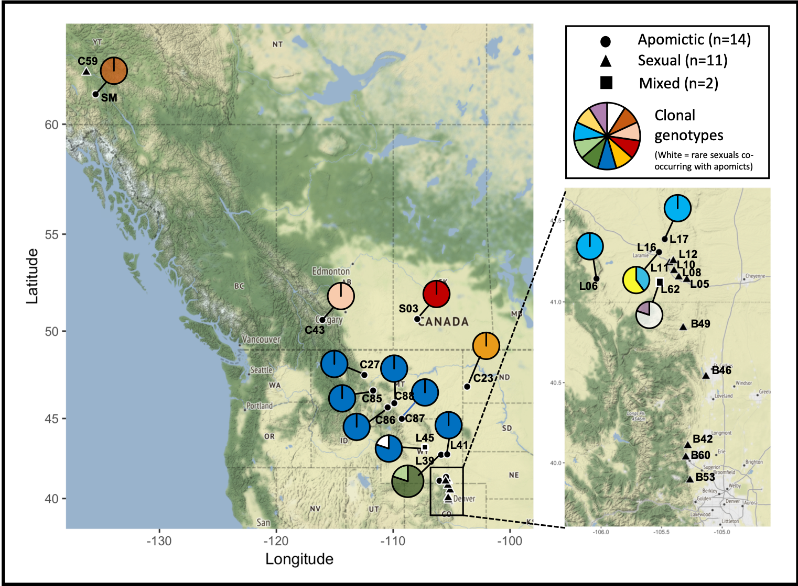
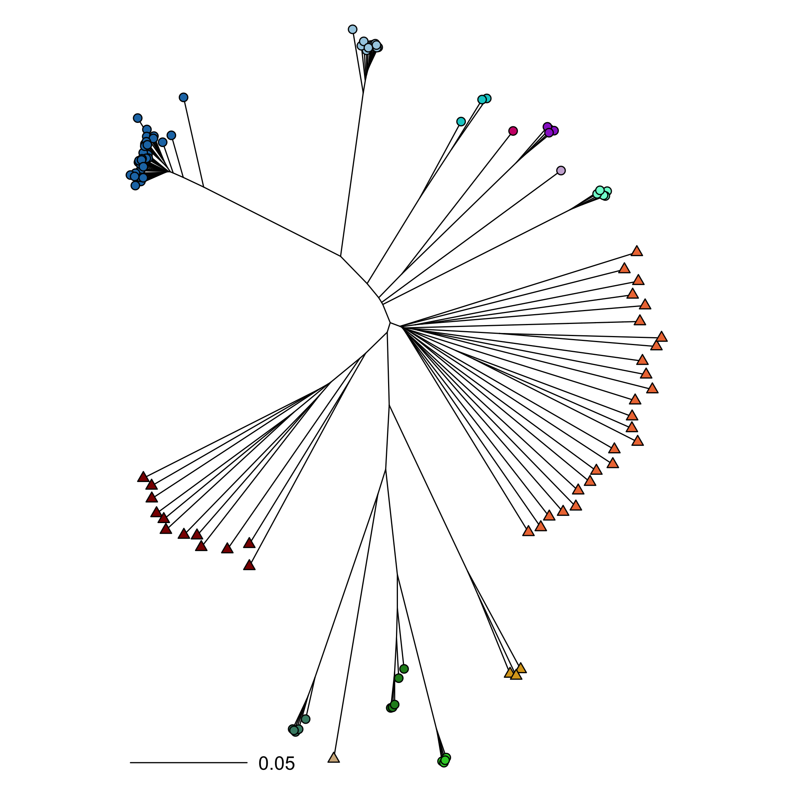
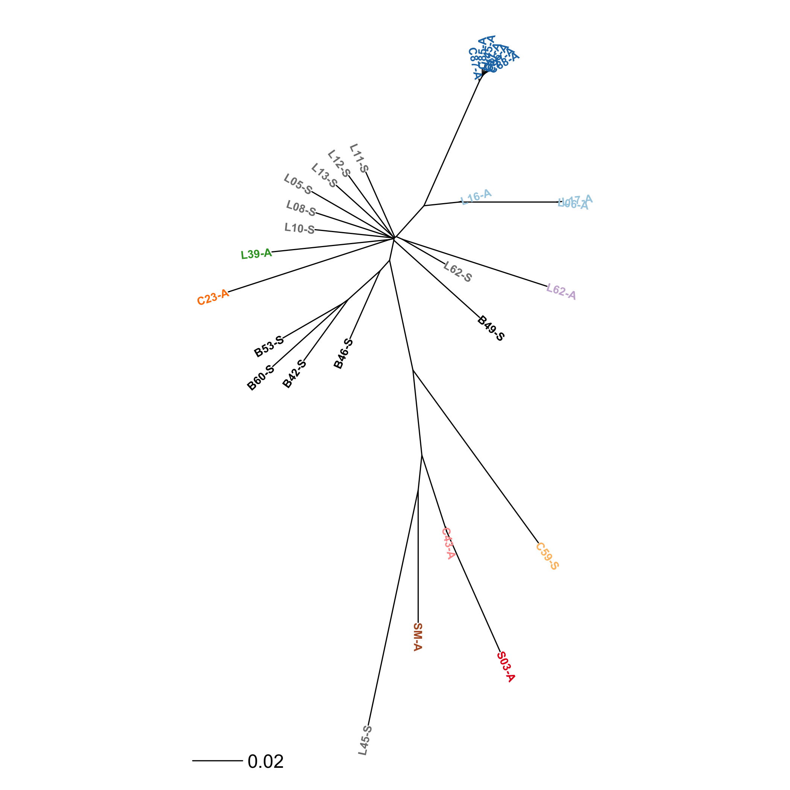
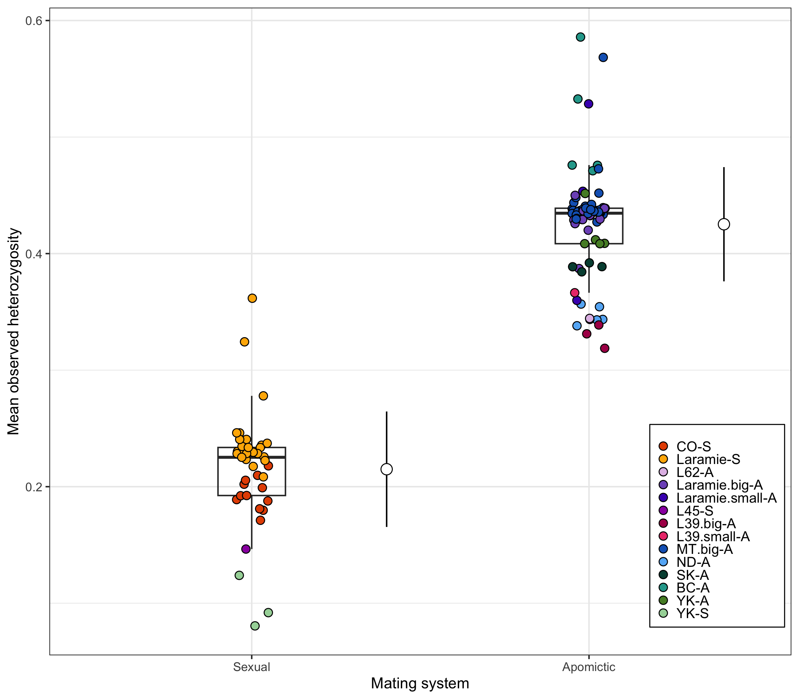

```{r dataprocess, include=FALSE, cache=TRUE, echo=FALSE}
knitr::opts_chunk$set(echo = TRUE)
```

```{r echo=FALSE}
knitr::read_chunk("gbs_results.R")
```

```{r echo=FALSE, cache=FALSE, results="hide", include=FALSE}
<<load>>
```


## Assembly, individual missingness and filtering

The assembly was created using only the diploid samples, and with the Yukon population removed (given its apparent distance from the rest of the sexual populations). SNPs were then called on the diploid reference using Freebayes, which is ploidy aware. This generated >400k SNPs, which were whittled down to ~16k SNPs using the following filtering steps:

1. Quality (QUAL < 30 & MQM < 30 & MQMR < 30 || AVG(GQ) < 20)
2. Remove SNPs that have >5% missing data (F_MISSING > 0.05)
3. Minor Allele Count and Frequency (MAC < 3 || MAF <0.05)
4. Depth below 20 and above 132.5 (AVG(FMT/DP)<20 || AVG(FMT/DP)>132.5)
5. Remove indels and keep only bi-allelic SNPs (--max-alleles 2 --exclude-types indels)
6. Allele balance below 0.125 and above 0.875
7. (Misc - from dDocent) remove SNPs found on both strands of the read, ratio of mapping qualities between reference and alternate alleles, discrepancy in properly paired status of reads supporting reference or alternate alleles, ratio of locus quality score to depth

<!--
```
# big filter. This filters based on quality, minor allele count, minor allele frequency, average depth (low and high), excludes indels and SNPs with more than 2 alleles, and removes SNPs that have >5% missing data. 
~/bcftools/bcftools filter TotalRawSNPs.vcf | bcftools filter -e "QUAL < 30 & MQM < 30 & MQMR < 30 || AVG(GQ) < 20 || F_MISSING > 0.05 || MAC < 3 || MAF <0.05 || AVG(FMT/DP)<20 || AVG(FMT/DP)>132.5" | bcftools view --max-alleles 2 --exclude-types indels --output-type v --output-file filter1.vcf

# allele balance
vcffilter -s -f "AB > 0.125 & AB < 0.875 | AB < 0.01" filter1.vcf > filter2.vcf

# SNPs found on both strands
vcffilter -f "SAF / SAR > 100 & SRF / SRR > 100 | SAR / SAF > 100 & SRR / SRF > 100" -s filter2.vcf > filter3.vcf

# ratio of mapping qualities between reference and alternate alleles
vcffilter -f "MQM / MQMR > 0.9 & MQM / MQMR < 1.05" filter3.vcf > filter4.vcf

# discrepancy in properly paired status of reads supporting reference or alternate alleles
vcffilter -f "PAIRED > 0.05 & PAIREDR > 0.05 & PAIREDR / PAIRED < 1.75 & PAIREDR / PAIRED > 0.25 | PAIRED < 0.05 & PAIREDR < 0.05" -s filter4.vcf > filter5.vcf

# ratio of locus quality score to depth
vcffilter -f "QUAL / DP > 0.25" filter5.vcf > final.filtered.snps.vcf

-->

<!-- Checking for individual missingness after an early filtering step showed this: -->

<!--  -->

<!-- It's hard to see the names, but two of the samples from C59 (Yukon) and one from B46 have over 30% missingness. We should probably remove those before filtering, because they retain high(ish) missingness even after filtering: -->

<!--  -->

<!-- After removing those three samples and filtering, our SNP count went from 16.2k to 17.1k (so not a huge difference). Here's what it looks like: -->

<!--  -->

<!-- Should we remove these individuals? -->

## Clone identification

Using poppr, we were able to identify the same number of clones (aka multilocus genotypes - MLGs) as the identity by state (IBS - from SNPRelate), but automatically and with the full ploidy information. One thing to note is that it grouped the sexual Yukon pop into the same MLG, which makes sense given that they had higher IBS values. The determination of MLGs in the apo's should not be biased by the distance metric used (I'm using prevosti.dist(), which ranges from 0-1) as the within-population pairwise comparisons are always between individuals of the same ploidy. I picked 0.1 as the MLG cutoff. The number of MLGs remains stable from around 0.09 - 0.13. 

```{r, fig.height=7, fig.width=10, cache=TRUE, echo=FALSE}
<<MLGs>>
```

<br/><br/>

I also calculated pairwise distances within MLGs (apos) and populations (sexuals) and plotted them. The dashed line represents the mean distance between replicate pairs (as a proxy for error-rate), which falls right on top of our within-clone distance peak, which indicates to me that clones are pretty darned identical to each other. There's also a nice separation between the apo and sexual peaks, which gives me confidence that there's a clear separation between things that we're calling "clones" and everything else. Note that there are a few red bars on the blue (apo) side of the plot...these are the sexual individuals from the Yukon population, which are most likely inbred / bottlenecked due to being disjunct from the rest of the sexual range for untold generations (*** they also have high levels of missingness, which probably contributes...we should remove the Yukon population?). The small blue hump at the same spot is from the "big MLG", which may indicate that there are actually two (closely related) clones here...

It's also worth noting that Meirmans et al (2018) report that this exact type of comparison (diploid-diploid vs polyploid-polyploid) is biased, so we should take these results with a grain of salt...



## Map



## K-means clustering

I used a K-means approach from the adegenet package (following this tutorial: http://grunwaldlab.github.io/Population_Genetics_in_R/clustering_plot.html), which uses a clustering algorithm that is similar to STRUCTURE. This is just looking at the apomictic individuals. **Plot A** below is based on 50 runs of the find.clusters algorithm, and shows that ~8-13 clusters have the lowest BIC. **Plot B** is a scatterplot of the discriminant functions (K=8), which helps us see how different the resulting clusters are. **Plot C** shows barplots of the posterior probability group assignments for K = 8-12, which helps visualize how the groups are assigned under different values of K. 

A new paper from Patrick Meirmans' group suggests that STRUCTURE is better than K-means and other clustering approaches for mixed-ploidy populations. However, this is only really a problem (for K-means) if you have low numbers of markers and missing dosage information...fortunately for us we have full dosage and tons of markers. My understanding is that DAPC is still better for us because it uses model-free methods, while STRUCTURE assumes panmixia and that markers are not linked. 

These results are more-or-less congruent with the MLG designation based on genetic distance. When K=8, the BC and SK pops are grouped together, as well as the L62 apo + the one-off from L39 (these are different clones using genetic distance cutoffs). As K increases, it breaks up the big MLG (in blue), which could indicate that there are actually two closely related clones within that MLG (decreasing the distance cutoff does eventually split that MLG...).


## Ploidy confirmation

This is a cool way to confirm ploidy using genomic data found here: https://knausb.github.io/vcfR_documentation/determining_ploidy_1.html. Basically, you can harness the 'DP' (sequencing depth) field from your VCF files to calculate the ratio of times each allele was sequenced in each individual. The idea is that if you sequence a diploid heterozygote (A/T) at 30x coverage, we would expect to sequence each allele around 15 times (giving an allele balance of 1/2). For a triploid (A/T/T), we'd expect to sequence the 'A' 10 times and the 'T' 20 times, giving allele balances of 1/3 and 2/3. If calculate the mean allele balances for each individual and plot them, you'd thus expect to see a single peak at 1/2 for diploids, two peaks (1/3 and 2/3) for triploids, and 3 peaks (1/4, 1/2, and 3/4) for tetraploids.


## DAPC

Here's my new and improved DAPC:


<!-- ```{r, fig.height=5, fig.width=8, cache=TRUE, echo=FALSE, fig.cap="Using MS as the two groups (Density plot of DF1). Note how the sexuals are spread out, but the apos are in dense spikes..."} -->
<!-- <<DAPC.ms>> -->
<!-- ``` -->

<!-- <br/><br/> -->

<!-- ```{r, fig.height=5, fig.width=8, cache=TRUE, echo=FALSE, fig.cap="Pops as groups, but colored by mating system. Notice how the apos form 7 tight groups, in contrast to the 10 MLG designations...."} -->
<!-- <<DAPC.popms>> -->
<!-- ``` -->

<!-- <br/><br/> -->


<br/><br/>

zooming in a bit...


<br/><br/>

Here's a plot of the posterior membership probabilities from the DAPC. This depicts the same groupings as the MLGs except that L39 has one clone instead of two...


## MSN

This is a minimum spanning network. It can apparently be a more powerful visualization tool for clonal organisms than trees. Each pie represents a MLG, and the size of the pie represents the number of individuals assigned to that MLG. Blue pies are apo, red are sexual. This shows a similar pattern to the tree below, with the apos forming two groups. The big group of apos consitutes the majority of the clones and emerges from the Laramie sexuals, and the northern 3 clones (SK, BC, and YK) are closest to the YK sexuals...

```{r, fig.height=6, fig.width=8, cache=TRUE, echo=FALSE, results="hide"}
<<MSN>>
```

<!-- ## AMOVA -->

<!-- Here's my first AMOVA run. This uses an `ms/pop` heirarchy. This one is without clone correction: -->

<!-- ```{r, fig.height=6, fig.width=8, cache=TRUE, echo=TRUE} -->
<!-- <<AMOVA>> -->
<!-- ``` -->

<!-- <br/><br/> -->

<!-- Here's the AMOVA with clone correction -->

<!-- ```{r, fig.height=6, fig.width=8, cache=TRUE, echo=TRUE} -->
<!-- <<AMOVA.cc>> -->
<!-- ``` -->

<!-- I don't really know how to interpret this yet... -->

<br/><br/>

<!-- ## `Poppr` function - genotype richness/diversity/evenness stats -->

<!-- This shows us several summary statistics: -->

<!-- | Abbreviation | Statistic | -->
<!-- |------|---------------------------------------------------------------| -->
<!-- |`Pop` |  Population name.| -->
<!-- |`N` |  Number of individuals observed.| -->
<!-- |`MLG` | Number of multilocus genotypes (MLG) observed.| -->
<!-- |`eMLG` | The number of expected MLG at the smallest sample size ≥ 10 based on rarefaction | -->
<!-- |`SE` | Standard error based on eMLG.| -->
<!-- |`H` | Shannon-Wiener Index of MLG diversity| -->
<!-- |`G` | Stoddart and Taylor’s Index of MLG diversity| -->
<!-- |`lambda` | Simpson's Index| -->
<!-- |`E.5` | Evenness, $E_5$| -->
<!-- |`Hexp` | Nei's unbiased gene diversity| -->
<!-- |`Ia` | The index of association, $I_A$| -->
<!-- |`rbarD` | The standardized index of association| -->

<!-- Here are the results from the `poppr` function on the populations. -->

<!-- ```{r, cache=TRUE, echo=TRUE} -->
<!-- load("hookeri.poppr.pop.RData") -->
<!-- hookeri.poppr.pop[-c(4,5,10,15)] -->
<!-- # <<Poppr>> -->
<!-- ``` -->

## NJ Tree on populations

Here's a NJ tree of all sexual individuals (red) and one representative from each MLG (blue). It uses pairwise provesti distance, the same distance matrix used to designate MLGs.

This shows (similar to the above MSN) that the apos form two groups that can be traced back to two branches on the tree. One interpretation is that all sampled MLGs had two sexual origins, but I don't really buy that. For one, the lengths of the apo branches are quite long, about on par with the lengths between sexual individuals. I find it hard to believe that apo lineages would accumulate that many differences due to somatic mutation alone. Also, it's quite likely that we didn't sample the sexual populations of origin for these apos (probably because they no longer exist...?), which would make it quite difficult to reconstruct origins (using these data at least...).



Here's pop trees (Nei's distance). This is for all pops.



This is for only sexuals.


## Heterozygosity

I've calculated observed heterozygosity by ploidy level and by apo MLG. As expected, triploids and diploids have much higher levels of heterozygosity, with the mean Ho for polyploids being around double the diploids. Looking at the within MLG Ho (I tried to name them based on geography - MT_big is the big multi-pop MLG and Lrmy_big is the widespread Laramie clone.). This may be an indication of clone age, where we'd expect a positive relationship between heterozygosity and age (I think that's right?). 



